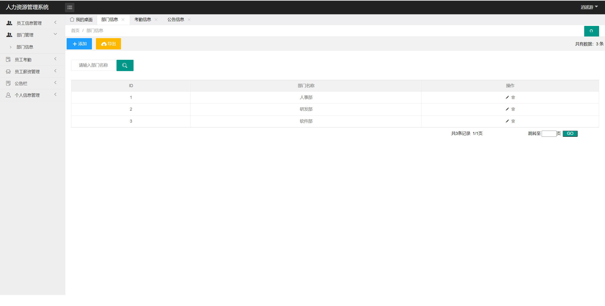
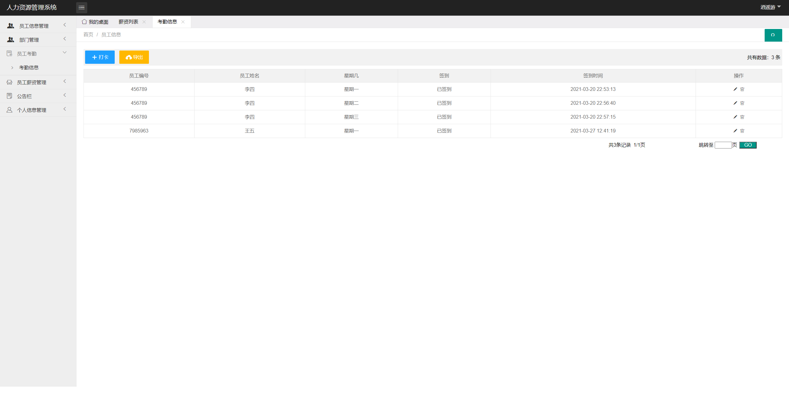
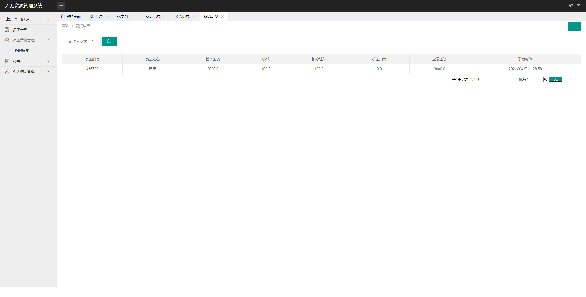
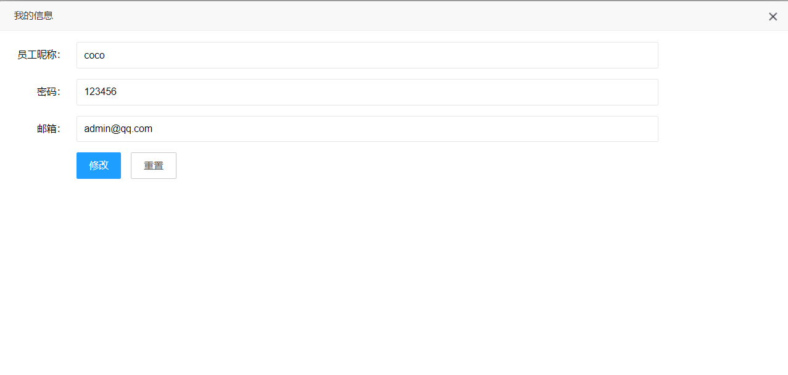
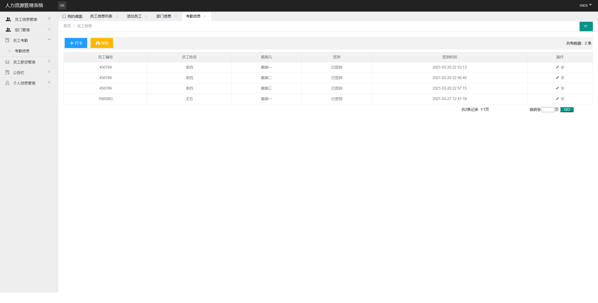
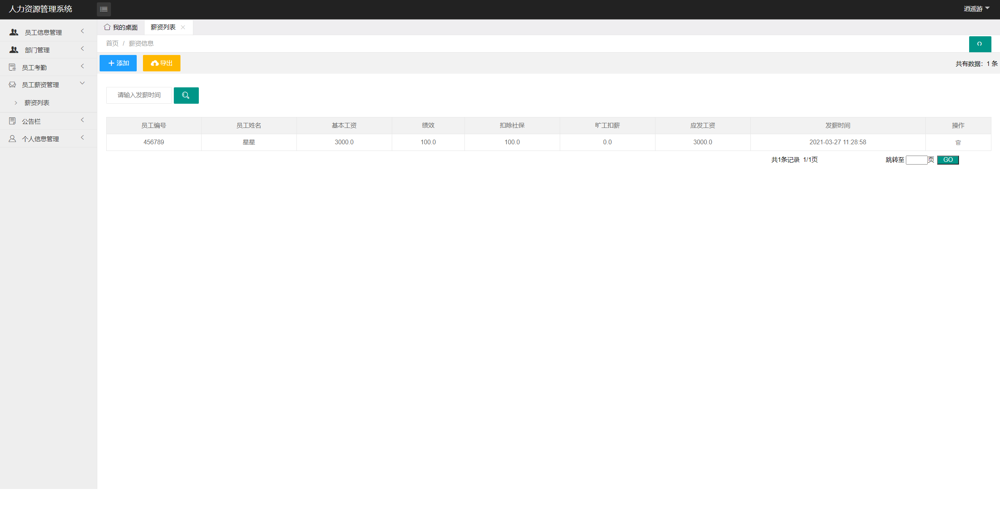

## 基于SSM的人力资源管理系统

###  获取sql数据库文件: 从戎源码网 (https://armycodes.com/) QQ: 386869957 QQ群: 377586148
###  所有系统地址: (https://github.com/YuLin-Coder/AllProjectCatalog) 
###  所有项目以及源代码本人均调试运行无问题 可支持远程安装部署调试、定制修改、代码讲解

## 项目介绍
基于SSM的人力资源管理系统，有员工和管理员两个角色，主要功能如下
本系统主要是管理员登录以后可以对员工、部门、薪资、考勤、公告进行综合性的管理。
主要功能
员工登录以后可以修改个人信息、查看部门、打卡签到、查看薪资发放、查看公告等。
管理员登录后可以对个人信息进行修改、主要员工管理、部门管理考勤管理、员工薪资管理、公告管理。

## 项目技术
- 编程语言：Java
- 数据库：MySQL
- 前端技术：Layui、JSP、JS、JQuery、Ajax
- 后端技术：Spring、SpringMVC、MyBatis

## 运行环境
- JDK版本：JDK1.8及以上
- 开发工具：IDEA、Ecplise、Myecplise都可以
- 数据库: MySQL5.7及以上

## 运行截图

